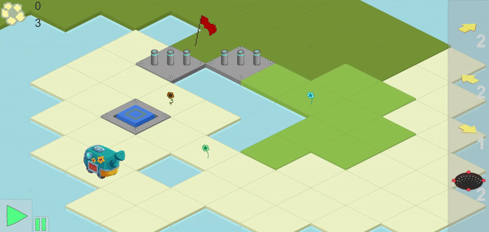
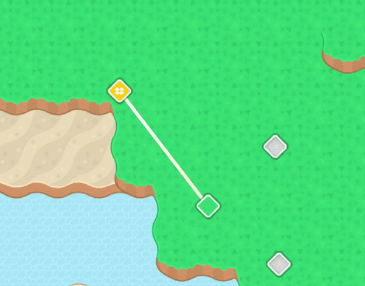
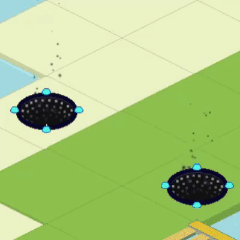
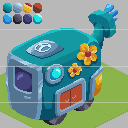
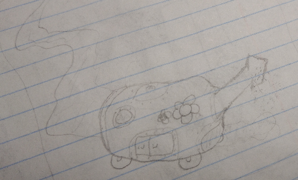

# Overview

## About
'Agronaut' is the working title for an isometric puzzle game I'm developing in my spare time in Unity.
The idea is that the player will help a car navigate its way through the world using a limited number of tiles (arrows, teleporters, etc.).

## Downloads
[Latest demo (Windows x86)](https://www.dropbox.com/s/lt0gx84jbbjx541/Agronaut-Aug2020.zip?dl=0) (23MB)
Still a very early version with its fair share of problems. SFX and music are very lacking, but serves as a good demonstration of the levels that have been made so far and the current feature set.

## Early Gameplay
Tiles are dragged in from the right panel into the level. Many graphics here are not final (the flag...), and this GIF is pretty heavily artifacted.

# Devlog

## Victory Animation - June 2020
The victory animation is making progress -- I made a custom particle effect using some more [Kenney Assets](https://www.kenney.nl/assets) and used it to make both a goal tile and a victory trail effect for the car.

## World Map - June 2020
Overhauled the world map using some [Kenney Assets](https://www.kenney.nl/assets), and animated the message boxes. Starting to look a lot better -- currently a level has up to four different "completion metrics", and all of these are reflected on the world map now:
* completed
* completed with all flowers collected
* completed with bonus goal met
* completed with both the bonus goal met and all flowers collected

## Teleportation Animation - March 2020
I finally got the teleportation animation looking the way I want it. Previous iterations didn't make it entirely clear that the player was entering the teleporter, which isn't ideal especially since it's already a little hard to tell what you're looking at. At some point I need to soften the pixel art on the edge of the teleporter, but I'm pretty happy with this.

I'm also pretty pleased with my implementation of the teleporter system -- when a teleporter starts in or is placed into the scene, it registers itself with a teleporter manager, which handles connecting and disconnecting teleporters when they enter and leave the scene. At first the teleporters were managing themselves, which got particularly complicated when I introduced the "void" tile, which can remove any other tile from the board, meaning they would have to be inactive and disconnected temporarily.

## Player Car Commission - December 2019
I wanted to commission the "player character" car to get a feel for what the art style of the rest of the game should be like -- thanks to [markleoart](https://www.fiverr.com/markleoart) for doing a great job!

## Early Design and Inspiration - September 2019
I was playing _Professor Layton and the Unwound Future_ on vacation -- a great game for relaxation -- and became obsessed with a gimmicky minigame within the game loosely referred to as [the Toy Car minigame](https://layton.fandom.com/wiki/Toy_Car). The general idea is that, given access to a limited number of arrows that you can place on a grid, you must direct your car to the flag while collecting objects strewn about the level.

This minigame doesn't explore the idea very much, but I couldn't stop thinking about making my own version. My plan was to increase the complexity by adding many different types of tiles that weren't present in the Layton minigame, such as teleporters, slime blocks, ice tiles, etc.

I also wanted to focus on a theme of nature vs machines, with pickups being various flowers and the car being a cute and bouncy gardening car. Below is an early sketch I made of the idea:

# Current Progress
## Tiles implemented thus far
* Simple arrow
    * Changes the player's direction toward the arrowhead
    * Also implemented single-use arrow
    * Also implemented rotational arrow
* Spring
    * Allows the player to jump over obstacles
* "Slime"
    * Reverses player direction when ran into
    * When landed on from jumping, acts as a spring
* Button
    * Toggles doors and teleporters opend and closed
    * Color-coded
* Freeze bomb
    * Turns surrounding water into ice, which can be driven across
    * Ice can only be driven across one time
* Teleporter
    * Simply teleports the player to another teleporter
    * Color-coded
* "Void"
    * Negates the tile it's placed on top of