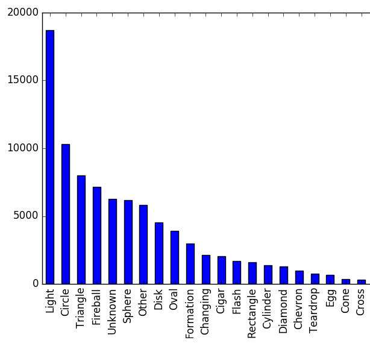

## June 2020: Persona 4 Golden Modding
With P4G finally coming to PC this month, I've been immersing myself in its modding community. A lot of the decompilation tools out there seem to have trouble with certain files, but despite that I managed to make [a few mods](https://github.com/knispeja/P4G-Disable-Trap-Chests) revolving around modifying what comes out of chests while in dungeons.

The [Reaper in Every Chest](https://gamebanana.com/gamefiles/12061) version of the mod is seeing a good amount of use because it makes grinding easier, but a few bugs have been reported, probably due to the way I had to hack the decompiled code back together. Even if I tried to recompile this particular unmodified decompiled script, I got an error, indicating it's a problem with the tool (either the decompilation or recompilation half).

I also messed around with dialogue editing, but the tools available also make this process hit-or-miss:

There are more things I want to try in this space -- I added a channel to the TV but couldn't seem to get it to show anything but the weather, for instance -- but I think I'll leave it alone for now to see if the tools available improve at all with the arrival of the game to PC.

## June 2020: Word Games
I've been playing with the idea of developing a procedurally generated roguelike where word games serve as the primary gameplay mechanic, e.g. anagrams or word searches. I spent a week or so working on a data structure that can efficiently serve a random word of a given length and complexity so that the difficulty of the game can increase as the player progresses. I loaded [SCOWL (spell checker oriented word lists)](http://wordlist.aspell.net/) into it for now and it actually works quite well, despite it not being the primary purpose for those word lists.

[Here's a small demo](https://www.dropbox.com/s/0szfblc2qncnwtb/Vocabula-Aug2020.zip?dl=0) (Windows, 18MB) of the "anagram gate" system I have working already, that was procedurally generated with a very basic algorithm. Example gif of the basic gameplay below.

## May 2020: Scraping UFO Data
I ran across [this repository of interesting public datasets](https://github.com/awesomedata/awesome-public-datasets) recently and, since I was just working on improvements to an older data science project of mine, I thought it would be fun to exercise those muscles again. Without any clear goal, I narrowed down my options to a few datasets with COVID-19 data and [the National UFO Reporting Center database](http://www.nuforc.org/webreports.html), and decided an escape from reality would be nice...

NUFORC proved deceptively annoying to scrape -- a lot of their links are broken, and an equal number of their report links lead to completely empty pages, so the final version of my scraping script ended up being fairly robust. I haven't used Python in awhile, though, so it's pretty crusty. In the end, I scraped ~90MB of UFO report data dating back decades.

I don't have any big ideas for how to use the data yet, but I found [this awesome website](http://metrocosm.com/ufo-sightings-map.html) that used an older version of the same data to create a UFO sightings map. I'm toying with the idea of doing some NLP to get some interesting insights out of it, but I'm not sure yet.
Check out my progress [here](https://github.com/knispeja/NuforcAnalysis).

Also, here's a quick sample graph from the data I collected. It's a frequency chart of the reported shape of the sighted UFO, with the Y axis representing the number of reports of that shape:

## May 2020: Color Glossary Improvements
I was glancing back through my old projects and looked to the [color glossary](https://www.jacobknispel.com/ColorGlossary) page I made, and had a few issues with it. It provided "percentage similar" to the selected color, which was basically always 99%, so that seemed silly. The search function had some serious issues as well, and it wasn't too hard to find near-duplicate color names in the list.

I fixed up the search method (which was barely functional -- not sure what I was thinking), added Crayola colors to the mix, removed the "percentage similar" stat altogether, and added the capability to link to a specific color in case you want to show your friends. Feeling pretty good about where it's at now, probably won't change it for a long time!

## April 2020: Hatching and Dithering in Unity
After finishing Return of the Obra Dinn, I've become obsessed with unusual processing effects on 3D gameplay. I came across someone who makes excellent Unity filters such as [this hatching effect](https://github.com/keijiro/KinoHatch) and [this dither effect](https://github.com/keijiro/KinoBinary), which I think are really cool. I used the dither effect to create a retro feel for a demo for a 3D, dialogue-heavy investigation game I'm experimenting with.

Obviously, these kind of effects don't necessarily make a game look better, but they give it a distinct look that can set it apart, which can be much more important in the indie game scene. It can also cover up some modelling imperfections or blandness that is common in a lower-budget game. AAA games have some use cases for these effects as well -- the dither effect is often used in games when objects collide with the camera and transparency is to expensive.

Dithering on foliage in Uncharted 4:

Check out [Allen Chou's brain dump of what he worked on for Uncharted 4](https://allenchou.net/2016/05/a-brain-dump-of-what-i-worked-on-for-uncharted-4/) if you get a chance (there's a section on dithering), it's pretty interesting.

## September 2019: Queeb
Almost a month ago, I made the short trip to Naperville to see the first live show some YouTubers I'm fond of were putting on in their ["We Are Two Different People Tour"](https://shop.wearetwodifferentpeopletour.com/). All said, it was pretty good, although it was a little startling to realize how young their audience is...

In any case, one of their bits involved a fictional app called "Queeb" which was "sponsoring" their comedy show. The most interesting part of the bit to me was the number of people in the crowd that checked their phones to see if it was a real app -- it wasn't. So, I thought it would be fun if I enhanced their joke a little by creating [a real app](https://play.google.com/store/apps/details?id=io.github.knispeja.queeb) that was in on the joke.

In the end, it got about 500 downloads before the tour was over and maintained a 5-star rating. Around 30 of those downloaders emailed the in-app contact link asking for "Queeb Coins" and the like -- hopefully the whole thing made some people smile!
